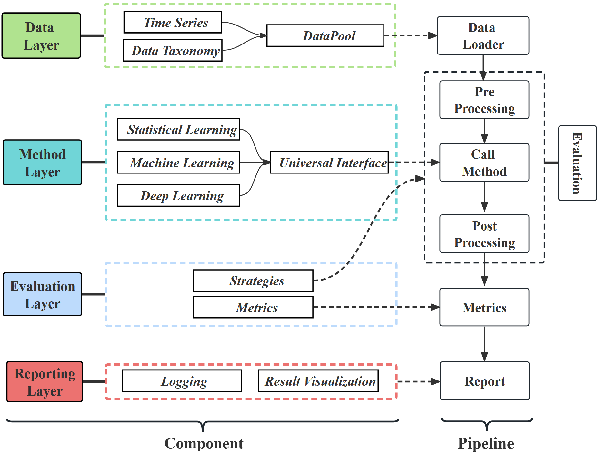

# TFB-2: Benchmarking and Automated Method Ensemble for Time Series Forecasting

## Introduction

This code is the official implementation of our paper: TFB-2. TFB-2 consists of two components: TFB, a comprehensive TSF
benchmark pipeline, and AutoTFB, an automated forecasting framework.

The below figure provides a visual overview of TFB.

The below figure provides a visual overview of AutoTFB.

## Quickstart

This project consists of two main components: **TFB** and **AutoTFB**. You can get started by referring to the following
documents:

- **TFB**: For TSF benchmark, see [here](TFB/README.md).
- **AutoTFB**: For automated forecasting framework, see [here](model_selection/README.md).

