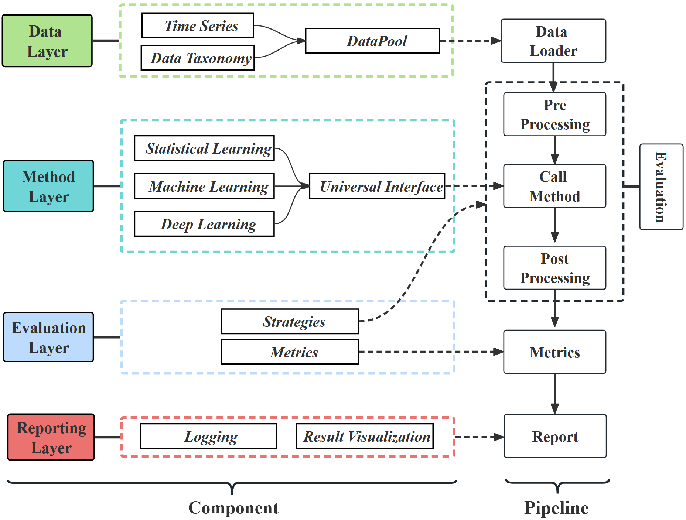

# AutoTFB

## Introduction

We provide a automated time series forecasting framework which via both model selection and model ensemble.

Here is the model selection pipeline. The implementation code for model ensemble is located in
the [ensemble](./TFB/ts_benchmark/baselines/ensemble/ensemble.py) directory.

The below figure provides a visual overview of AutoTFB's automated time series forecasting framework.
<div align="center">

</div>

## Quickstart

1. Installation:

- From PyPI

Given a python environment (**note**: this project is fully tested under **python 3.8**), install the dependencies with
the following command:

```shell
pip install -r requirements.txt
```

2. Data preparation:

You can obtained the well pre-processed datasets
from [Google Drive](https://drive.google.com/file/d/12LLOC6ThtlAbLu0LseW2eQeSXBJNbJH4/view?usp=sharing). Then place the
downloaded data under the folder `./dataset`.

### 3. Train and evaluate the model

We provide training and evaluation scripts under the folders `./scripts/multivariate` and `./scripts/univariate`.  
For example, you can reproduce an experimental result by running:

```bash
sh ./scripts/multivariate_forecast/mae.sh
```

The result will be saved in a CSV file. The `predict_{metric}` column represents the recommended score — for the same
dataset, a higher score indicates a stronger recommendation for the corresponding model.
